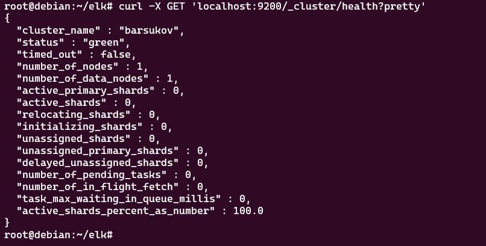
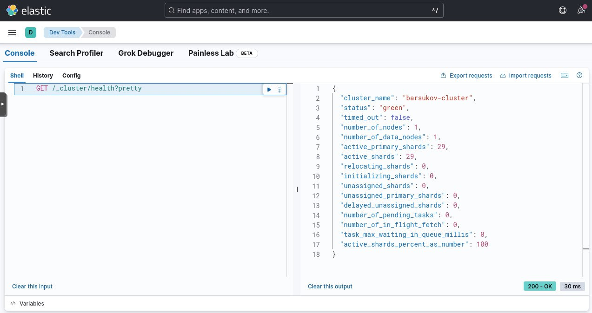
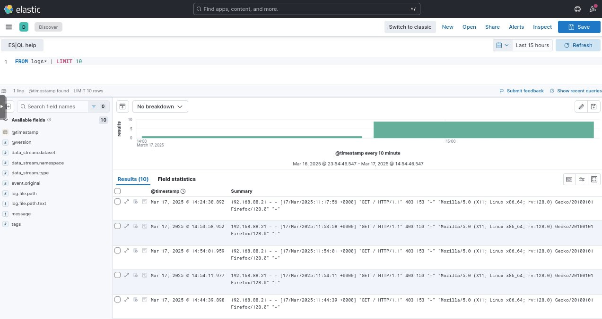
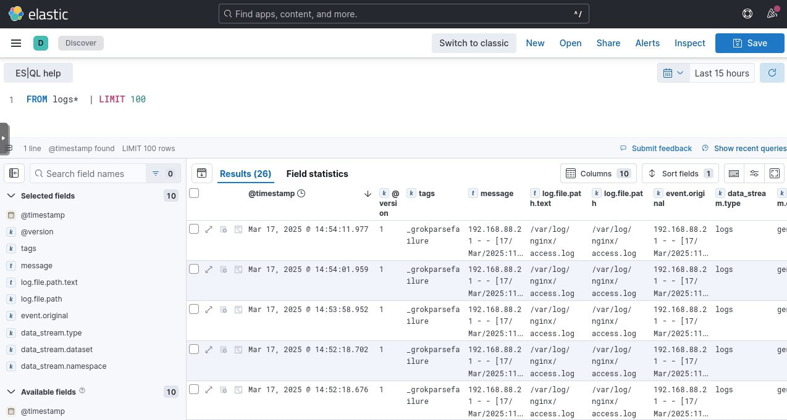
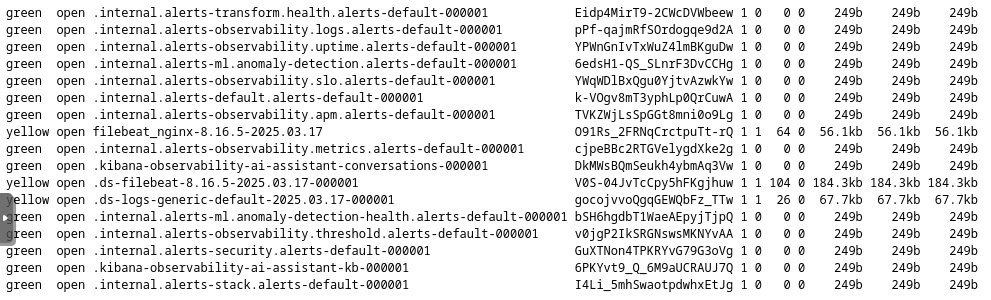
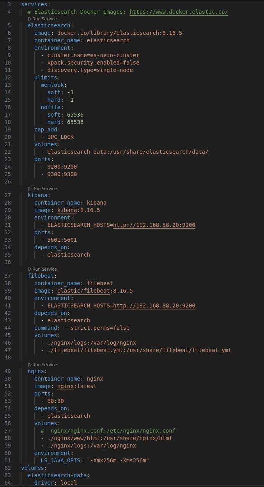
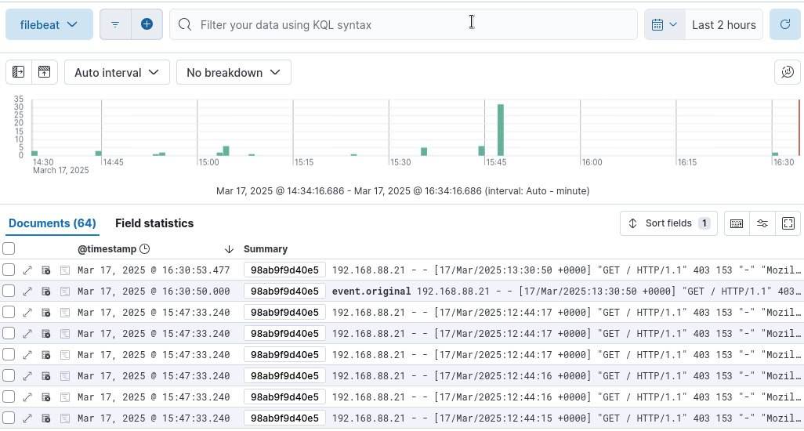

# Домашнее задание к занятию "`ELK`" - `Барсуков Алексей`


### Инструкция по выполнению домашнего задания

   1. Сделайте `fork` данного репозитория к себе в Github и переименуйте его по названию или номеру занятия, например, https://github.com/имя-вашего-репозитория/git-hw или  https://github.com/имя-вашего-репозитория/7-1-ansible-hw).
   2. Выполните клонирование данного репозитория к себе на ПК с помощью команды `git clone`.
   3. Выполните домашнее задание и заполните у себя локально этот файл README.md:
      - впишите вверху название занятия и вашу фамилию и имя
      - в каждом задании добавьте решение в требуемом виде (текст/код/скриншоты/ссылка)
      - для корректного добавления скриншотов воспользуйтесь [инструкцией "Как вставить скриншот в шаблон с решением](https://github.com/netology-code/sys-pattern-homework/blob/main/screen-instruction.md)
      - при оформлении используйте возможности языка разметки md (коротко об этом можно посмотреть в [инструкции  по MarkDown](https://github.com/netology-code/sys-pattern-homework/blob/main/md-instruction.md))
   4. После завершения работы над домашним заданием сделайте коммит (`git commit -m "comment"`) и отправьте его на Github (`git push origin`);
   5. Для проверки домашнего задания преподавателем в личном кабинете прикрепите и отправьте ссылку на решение в виде md-файла в вашем Github.
   6. Любые вопросы по выполнению заданий спрашивайте в чате учебной группы и/или в разделе “Вопросы по заданию” в личном кабинете.
   
Желаем успехов в выполнении домашнего задания!
   
### Дополнительные материалы, которые могут быть полезны для выполнения задания


---

### Задание 1. Elasticsearch 

Установите и запустите Elasticsearch, после чего поменяйте параметр cluster_name на случайный. 

*Приведите скриншот команды 'curl -X GET 'localhost:9200/_cluster/health?pretty', сделанной на сервере с установленным Elasticsearch. Где будет виден нестандартный cluster_name*.


```
version: '3.7'

services:
  elasticsearch:
    image: docker.io/library/elasticsearch:8.16.5
    container_name: elasticsearch
    environment:
      - cluster.name=barsukov
      - xpack.security.enabled=false
      - discovery.type=single-node
    ulimits:
      memlock:
        soft: -1
        hard: -1
      nofile:
        soft: 65536
        hard: 65536
    cap_add:
      - IPC_LOCK
    volumes:
      - elasticsearch-data:/usr/share/elasticsearch/data
    ports:
      - 9200:9200
      - 9300:9300


volumes:
  elasticsearch-data:
    driver: local

```



---

### Задание 2. Kibana

Установите и запустите Kibana.

*Приведите скриншот интерфейса Kibana на странице http://<ip вашего сервера>:5601/app/dev_tools#/console, где будет выполнен запрос GET /_cluster/health?pretty*.



---

### Задание 3. Logstash

Установите и запустите Logstash и Nginx. С помощью Logstash отправьте access-лог Nginx в Elasticsearch. 

*Приведите скриншот интерфейса Kibana, на котором видны логи Nginx.*



---

### Задание 4. Filebeat. 

Установите и запустите Filebeat. Переключите поставку логов Nginx с Logstash на Filebeat. 

*Приведите скриншот интерфейса Kibana, на котором видны логи Nginx, которые были отправлены через Filebeat.*





